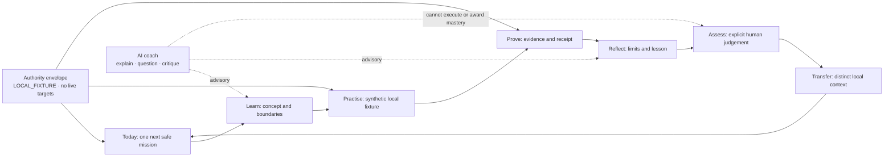
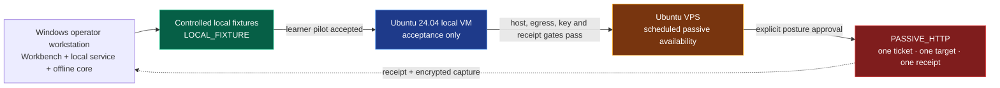

# AI-Native Learning Workbench

> **Status:** PRODUCT DIRECTION; visual selection open; implementation not yet complete
>
> **Current posture:** `LOCAL_FIXTURE`; no live targets; AI advisory only
>
> **Primary user:** a new security researcher learning web, API, bug-bounty,
> evidence, and agentic-system security through controlled local practice

This document defines the learner-facing product foundation for GreyTheory. It
does not widen authority and it does not claim that the redesigned workbench is
already implemented. The current thirteen-panel Research Ledger remains a
useful evidence-view prototype, but the 2026-09-01 audit found that it is not a
complete learner dashboard and that its 390-pixel layout clips core content.

## Product objective

GreyTheory should help a learner answer five questions at every moment:

1. What is the most valuable safe thing to learn or practise next?
2. Why is it recommended for me now?
3. What authority and environment govern the work?
4. What evidence would support or refute the theory?
5. What changed in my demonstrated capability after review?

The dashboard is therefore not a generic analytics surface. It is the visible
orchestrator for a bounded learning-to-proof loop.

## Information architecture

The primary navigation should follow the operator's mental model rather than
the storage model.

| Area | Operator question | Required surfaces |
|---|---|---|
| Today | What should I do next? | next safe mission, why now, time, prerequisites, due reviews |
| Learn | What do I need to understand? | curriculum, focused note, skill graph, vocabulary, controls |
| Practise | Can I apply it safely? | local labs, challenges, controls, reset, fixture provenance |
| Research | What may be true? | hypotheses, experiment plans, case canvas, ledger |
| Prove | What does the evidence support? | receipts, claim roles, validation, assessment, reviews |
| Library | What can I reuse? | cards, notes, playbooks, templates, artifacts |
| Readiness | What is safe and available? | posture, authority, storage, integrations, capability truth |

The chronological Research Ledger remains a first-class case view under
Research. It is not the home screen.

## Recommendation contract

A recommendation is inspectable decision support, not a model hunch. Every
recommended topic or mission must show:

- the card and exact mastery dimension;
- prerequisite state and any missing prerequisite;
- due-review or operator-goal reason;
- estimated time and local fixture;
- required evidence and assessment type;
- why this item outranks the next alternative; and
- provenance for every input used by the scheduler.

Recommendations may use the existing deterministic planner and transparent
adaptive review policy. A model may explain the recommendation in plain
language, but it may not secretly reorder the queue, invent mastery, award a
level, or convert an ordinal score into probability.

## Agent-security learning track

Agentic-system security is a first-class specialization built on web/API and
evidence foundations, not a detached list of prompt tricks.

| Stage | Topics | Minimum learning outcome |
|---|---|---|
| Foundations | instructions versus data, trust labels, identity, scope, least privilege | explain the boundary and identify the authority source |
| Input and context | direct and indirect prompt injection, context isolation, memory poisoning | recognise untrusted influence and propose controls |
| Tools and agency | tool authorization, MCP tool abuse, excessive agency, side-effect budgets | design a least-authority tool policy and a negative control |
| Data protection | secret leakage, cross-user context, exfiltration paths | trace data flow and prove isolation with synthetic identities |
| Evidence | transcript provenance, deterministic checks, variance, reproducibility | distinguish anomalous output from checked evidence |
| Transfer | a distinct local agent fixture and threat model | apply the method without hidden assistance |

The UI should always separate observation, candidate explanation, checked
evidence, and human judgement. None of those labels is a probability.

## Visualisation system

Visualisations must answer a learner question and expose their source. The
first implementation set is:

1. **Learner loop** — current stage, evidence requirement, and next transition.
2. **Skill trajectory** — prerequisites and six mastery dimensions without a
   misleading single percentage.
3. **Case canvas** — Authority -> Theory -> Safe experiment -> Receipt ->
   Reflection, with visible return paths when evidence changes the theory.
4. **Evidence-quality profile** — authority anchoring, relevance,
   reproducibility, minimal impact, and documentation, each linked to the
   supporting record.
5. **Review schedule** — due and upcoming human-assessment work.
6. **Activity heatmap** — time spent on active learning, including sessions that
   produced no finding.

Charts must render `UNKNOWN` as unknown, not zero. They must support keyboard
inspection, provide a text/table equivalent, and remain legible without colour.

## AI coach boundary

The coach can explain concepts, ask Socratic questions, suggest a falsifiable
theory or negative control, critique plans/evidence/reflections/drafts, and
translate deterministic scheduler reasons into beginner-friendly language.

The coach cannot contact a target, run a tool, approve an action, change
posture, submit, decide that scope exists, mark evidence as checked, award
mastery, complete an assessment, hide criteria, or read data above its provider
ceiling.

## Visual direction gate

The 2026-09-01 audit produced three grounded directions in the editable
[GreyTheory AI-Native Research Workbench Figma file](https://www.figma.com/design/1Agfk1l6iKvmNf8agWCqpB):

1. **Guided Mission Control** — recommended foundation; best daily orientation.
2. **Research Notebook + Skill Graph** — strongest focused-learning workspace.
3. **Adaptive Pathways + Case Canvas** — strongest visual systems model and the
   most expensive to implement and validate.

The recommended composition is Direction 1 as the shell, Direction 2's focused
learning note as the Learn detail, and Direction 3's case canvas as the Research
detail. Production UI implementation waits for explicit operator selection.

## Responsive and accessibility acceptance

The redesigned shell is not accepted until all of the following pass:

- no horizontal document overflow at 390, 768, 1024, and 1440 pixels;
- headings, actions, filters, graphs, and evidence records remain fully visible;
- primary touch targets are at least 44 by 44 pixels;
- one-column mobile order preserves next action -> reason -> learner loop -> supporting detail;
- desktop side rails become labelled drawers or bottom sheets on small screens;
- all navigation, dialogs, graphs, and assessment forms work from the keyboard;
- focus is visible and returns to the invoking control;
- graph meaning has a text/table equivalent; and
- screenshots are compared at matching viewport and state before acceptance.

## Delivery sequence

| Stage | Outcome | Current truth |
|---|---|---|
| D0 Audit | current desktop/mobile evidence and failure list | COMPLETE 2026-09-01 |
| D1 Direction | three grounded visual options and editable Figma board | COMPLETE 2026-09-01 |
| D2 Selection | operator chooses the shell and permitted borrowings | OPEN |
| D3 Foundations | tokens, typography, shell, responsive grid, navigation | PLANNED |
| D4 Today/Learn | recommendation, learner loop, focused lesson, skill graph | PLANNED |
| D5 Practise/Research/Prove | fixture handoff, case canvas, ledger, evidence | PLANNED |
| D6 AI coach | advisory-only explanation and critique through governed model gateway | PLANNED |
| D7 Acceptance | keyboard, accessibility, desktop/390, clean-user Windows package | PLANNED |

## Launch and transition

The passive lab research pilot launches first on the operator's **Windows
workstation**: packaged workbench, local application service, offline core,
private user-data root, and controlled local fixtures. Ubuntu is the later
isolated worker host, not the first desktop UI.

The first worker step is a local Ubuntu 24.04 VM for acceptance. A VPS becomes
reasonable only after the same worker image, durable egress controls, OS-bound
key handling, broker/receipt path, sustained clean operation, and explicit
human posture approval have passed. The workbench remains on Windows while the
worker receives one short-lived ticket and returns one receipt and encrypted
capture.

