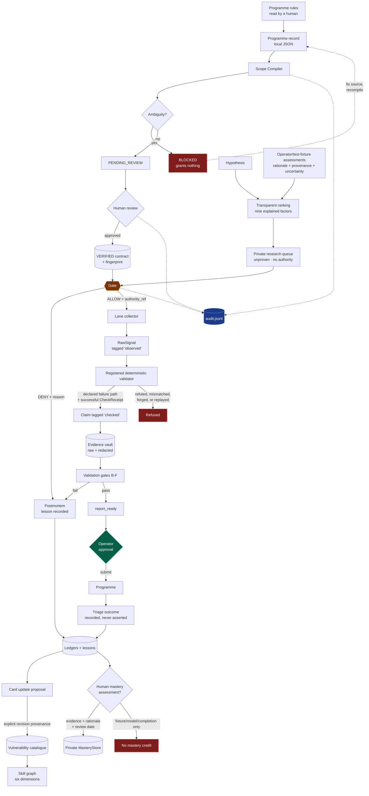

# Data Flow

How a programme's published rules become an artifact you can defend, and where each step is enforced.

## End to end

Solid lines carry artifacts. Dotted lines to `audit.jsonl` carry the record of what happened — including every denial, which is the part most systems throw away.

## What crosses each boundary

| Boundary | Carries | Never carries |
|---|---|---|
| Programme rules → record | Scope, exclusions, prohibited techniques, rate limits, timestamps | Assumptions about anything the rules did not say |
| Record → contract | Parsed patterns, source hash, ambiguity list | A grant of authority — that requires a human |
| Contract → gate | Fingerprint, granted level, prohibitions, freshness | The action itself |
| Gate → lane | A `Decision` with `authority_ref` | Credentials, or permission to widen scope |
| Lane → vault | Raw signals, tagged `observed` | Conclusions. A lane may not promote past `contextual` |
| Vault → report | Redacted evidence, `checked` claims, provenance summary | Raw artifacts, third-party data, secrets |
| Report → programme | What the operator approved, verbatim | Anything the operator has not personally read |
| Programme → ledger | The outcome the programme actually stated | Our own opinion of what it should have been |
| Lesson → card proposal | Evidence references, checked-claim reference, explicit source kind | Automatic catalogue mutation or a real-session claim |
| Human assessment → mastery store | One card, one dimension, named evidence, rationale, time, review date | Lab-completion credit, model judgement, credentials, or raw evidence |
| Hypothesis + ranking inputs → research queue | Contract/workspace binding, nine explained ordinal factors, unproven theory, assumptions, stops | Probability, severity, proof, finding status, action request, execution authority, or model judgement |

## Two flows that do not exist

**No lane-to-target path that bypasses the gate.** There is no code path in `greytheory/` that opens a socket, and CI fails the build if a network import appears there. When lanes are built they will live outside this package and will take a `Decision` as a required argument.

**No intelligence-to-Plane-2 path.** When Scope Watch is built (roadmap Milestone 8) it will flow into the programme record and hypothesis queue only. It will not reach a collector, influence a gate decision, or become canonical scope without human review.

## Data retention

| Class | Where | Retention |
|---|---|---|
| Programme records, contracts | Repository | Versioned indefinitely; contracts are re-verified, not edited |
| Audit log | Local, gitignored | Indefinite. Never edited, never rotated silently |
| Raw evidence | Private, outside the repository (O3 unresolved) | Minimum necessary; deleted after disclosure closes |
| Redacted evidence | Separate from raw | As long as the finding is open |
| Vulnerability catalogue | Package reference data | Versioned with source and revision provenance |
| Personal mastery assessments | Private learning root outside Git | Retained until operator policy changes; review dates make staleness visible |
| Ranked research queues | Private research root outside Git | Integrity-bound decision-support snapshots; operator-controlled retention |
| Third-party data | Never retained | Stop condition, not a retention policy |
