# Architecture Diagrams

Rendered by GitHub natively. Every diagram here reflects code that exists in `greytheory/` unless a node is explicitly marked *aspirational*.

---

## 1. The three planes

Authority is the root. Signal and Judgement both hang off it, and neither can reach a target except through the gate.

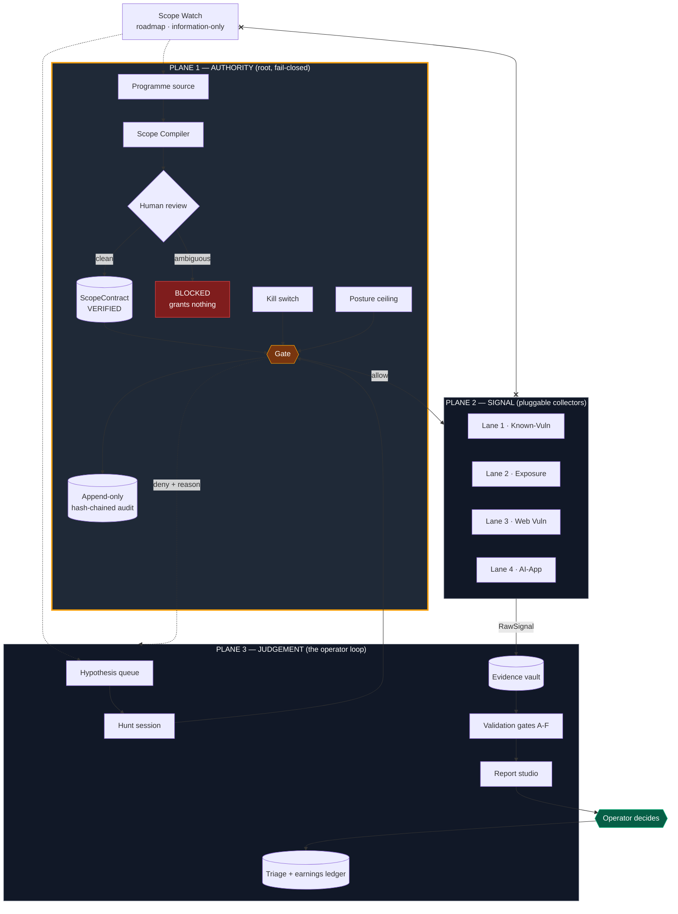

Scope Watch is dashed because it does not exist yet (roadmap Milestone 8). The crossed link to Plane 2 is its boundary made visible: external intelligence informs what we *look at* and what we *ask*, never what we *touch*.

---

## 2. Gate decision flow

Implemented in [`greytheory/authority/gate.py`](../greytheory/authority/gate.py). Every path — including every denial — writes an audit record before returning.

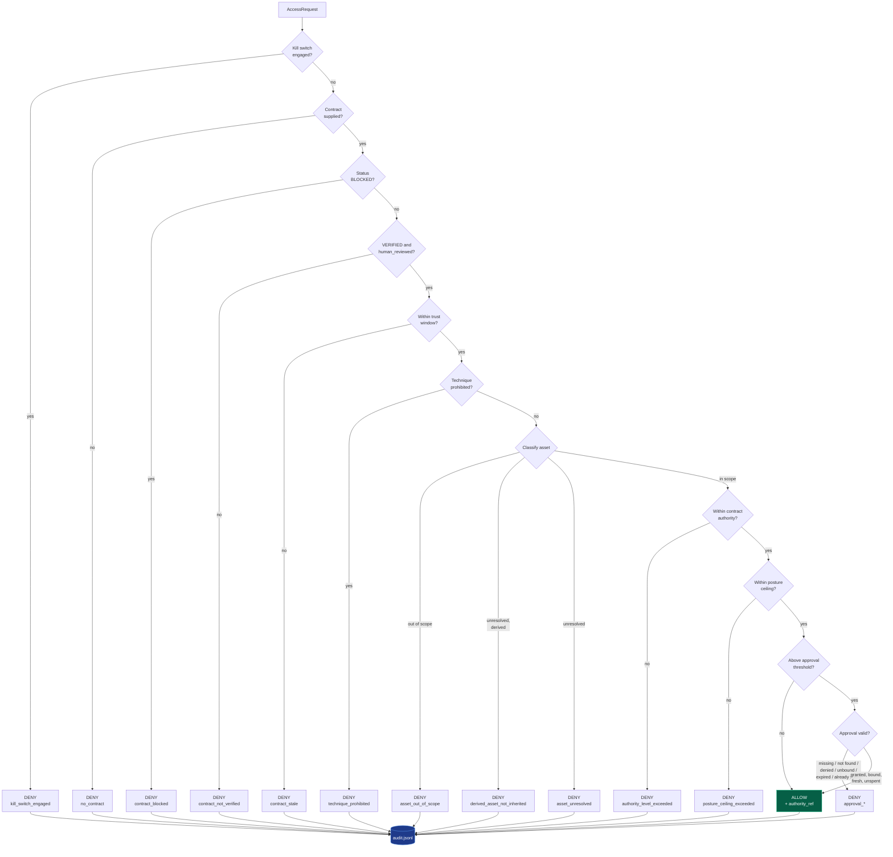

Seventeen ways to be denied, one way to be allowed. That ratio is the design.

---

## 3. Contract compilation

The compiler cannot produce a contract that grants anything. Only a human can.

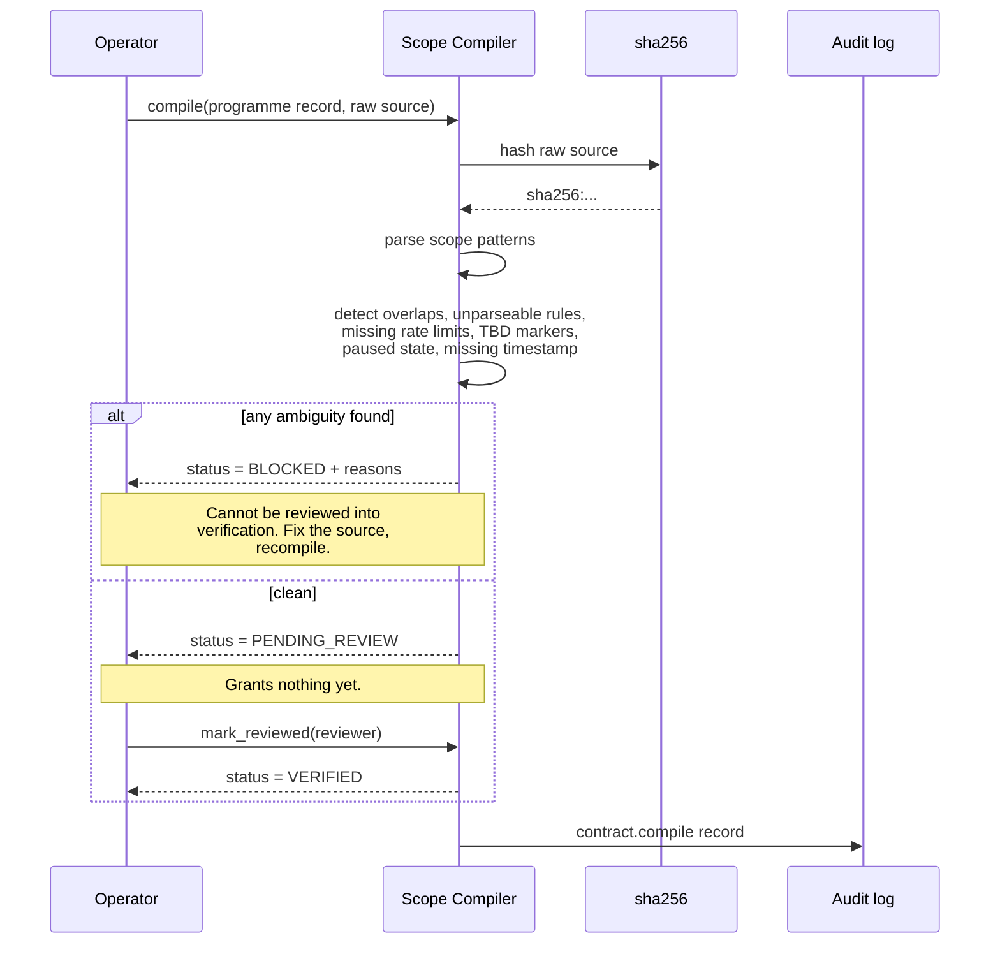

---

## 4. Finding lifecycle

Implemented in [`greytheory/findings.py`](../greytheory/findings.py). The dashed boundary is invariant I5 — everything past it is recorded from a programme, never asserted by us.

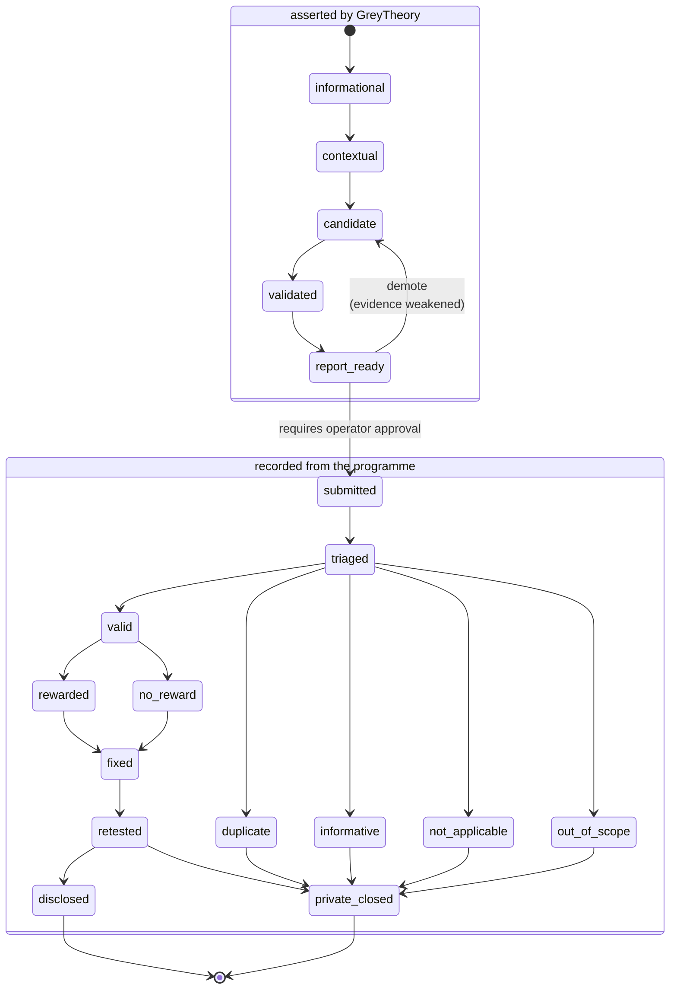

Two guards sit on that boundary:

- `report_ready` requires at least one `checked` claim. Inference alone is not a report.
- Every state past `submitted` requires `programme_evidence` — a reference to what the programme actually said.

---

## 5. The provenance triple

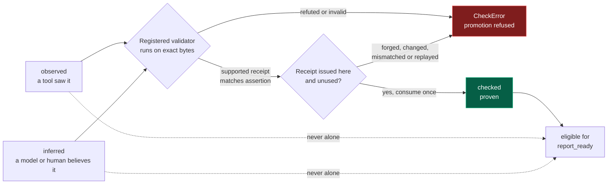

A check that cannot fail proves nothing. Promotion therefore consumes a
successful, matching `CheckReceipt` issued by a registered validator whose
declared outcomes include failure. Caller-created, modified, refuted,
mismatched, and replayed receipts are refused.

---

## 6. Authority levels

Two independent caps apply to every request: what the contract grants, and what the current operating posture allows. The lower of the two wins.

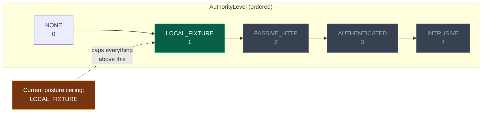

Greyed levels are unreachable under the current posture regardless of what any contract says.

---

## 7. Approvals — bound, expiring, single-use

Implemented in [`greytheory/authority/approvals.py`](../greytheory/authority/approvals.py). Scope says *what may be touched*; an approval says *that this specific act was consented to, once, recently*. Neither substitutes for the other.

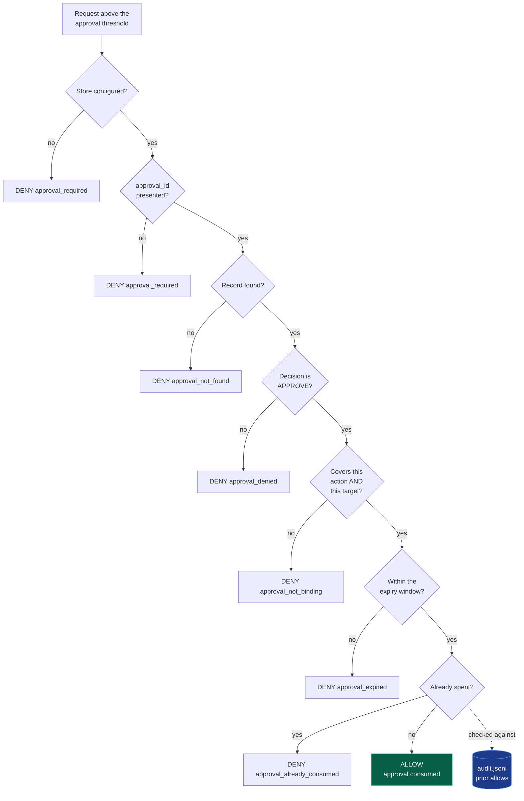

Single-use is enforced against the audit log rather than a second ledger — the log already records every allow, so it already knows what has been spent. Only *allows* consume: a denied attempt on the wrong target does not silently void a legitimate approval.

### Where approvals come from

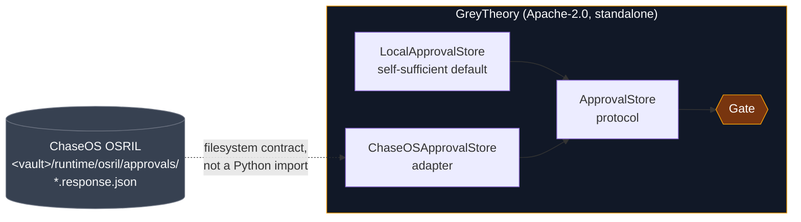

GreyTheory requires nothing external to run. Where an approval system already exists it reads from that one instead of keeping a parallel set of records — approvals recorded in one place and invisible to another are worse than either alone.

---

## 8. Evidence — raw stays, redacted travels

Implemented in [`greytheory/evidence.py`](../greytheory/evidence.py), policy in [`evidence-policy.md`](evidence-policy.md).

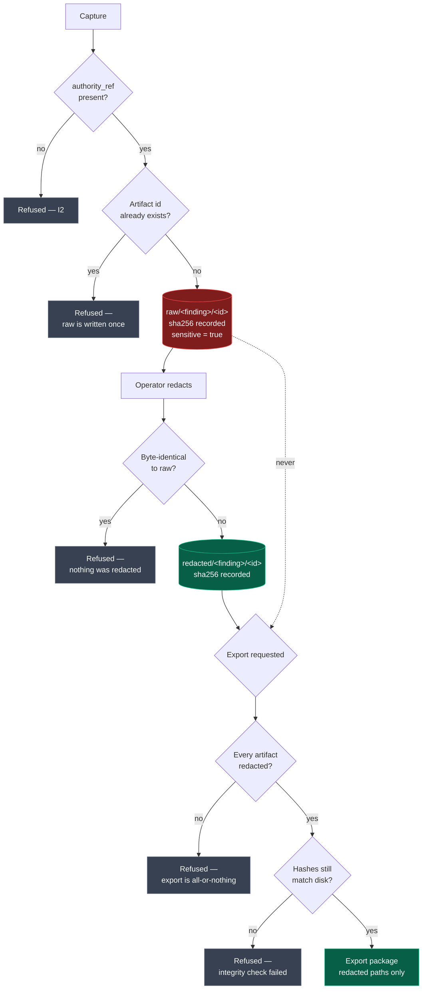

Red is private and never leaves. Green is the only thing that may be shared.

### Where the vault lives

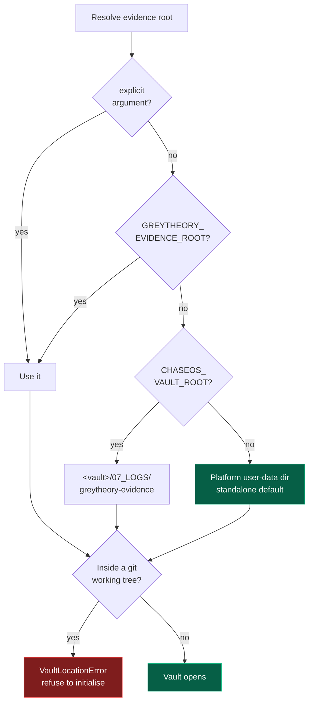

The guard is a wall rather than a convention. A `.gitignore` entry can be defeated by a `git add -f` or a tired evening, and raw evidence once committed and pushed is unrecoverable — it survives in the reflog, in forks, in caches.

---

## 9. Validation gates B–F

Implemented in [`greytheory/validation.py`](../greytheory/validation.py), policy in [`validation-policy.md`](validation-policy.md).

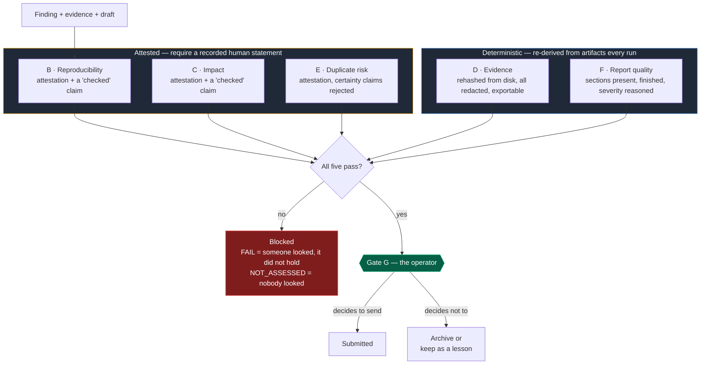

Passing every gate does not submit anything and does not advance the finding. It makes the finding *eligible* for Gate G, which is the operator's and is not automatable.

---

## 10. The whole path

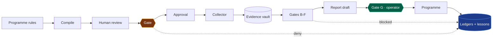

Every arrow is a place the system can refuse. The dotted lines matter as much as the solid ones — a denial and a blocked validation are both recorded as lessons rather than discarded.

---

## 11. Programme registry — scope over time

Implemented in [`greytheory/registry.py`](../greytheory/registry.py). The compiler answers "what do these rules mean today"; the registry answers "what changed since you last looked, and does your permission still hold".

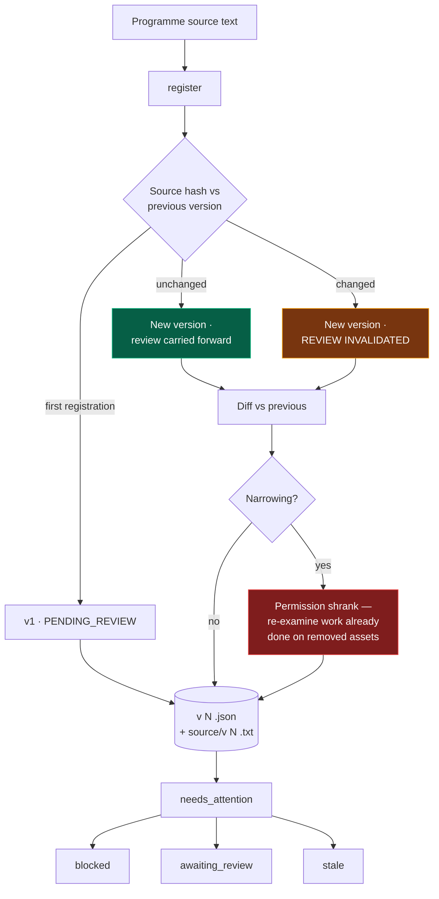

The rule that carries the module: **changed source invalidates the human review**, however thoroughly the previous version was verified. Review attaches to the text a person actually read, not to the programme in the abstract. Identical source carries the review forward, because re-reading unchanged text is friction with no safety value.

`needs_attention()` is the registry's real output. A list of programmes is inert; a list of reasons the permissions might not hold any more is what prevents scope amnesia.

---

## 12. The ledger — every hour, not just the productive ones

Implemented in [`greytheory/ledger.py`](../greytheory/ledger.py). Invariant I6 made structural.

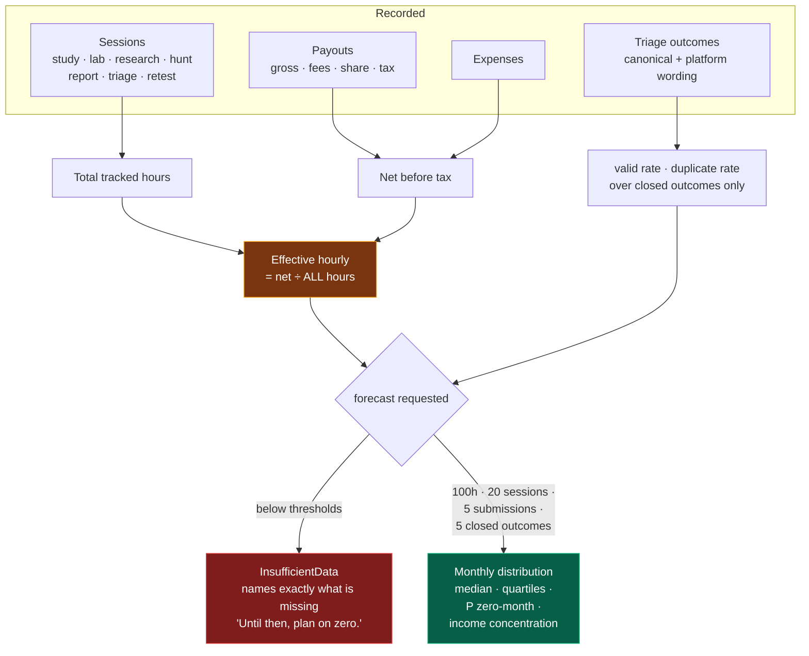

Two things this shape prevents. **The rate has no other version** — there is no parameter to divide by only the hours that produced something, because that is exactly how bug bounty starts looking like a good hourly rate. And **months with no payout stay in the distribution**; dropping them is how a zero-income month becomes invisible and the median starts describing a fantasy.

Income concentration is reported because when one payout dominates, the median is describing luck rather than a rate.

---

## 13. Vulnerability cards and the skill graph

Implemented in [`greytheory/learning/`](../greytheory/learning/). Reference
knowledge ships with the package; personal mastery state does not.

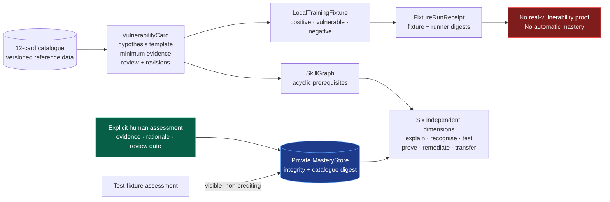

This shape prevents three silent promotions: a taxonomy mapping becoming
evidence, a synthetic lab becoming a real finding, and task completion becoming
mastery. Only a named, evidence-bound human assessment credits one dimension;
the other five remain unchanged.

---

## 14. Transparent hypothesis ranking boundary

Implemented in [`greytheory/hypothesis/`](../greytheory/hypothesis/). Ranking
orders existing theories for human planning; it cannot plan or execute them.

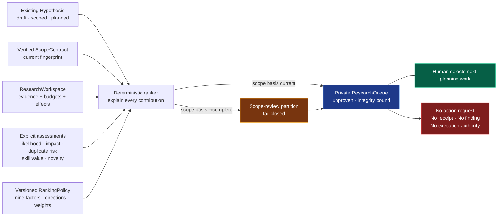

The four record-derived factors are scope confidence, evidence quantity, test
cost, and side-effect risk. The five explicit factors must identify their source
and uncertainty. The resulting number is an ordinal queue score only: it cannot
be reinterpreted as likelihood of a vulnerability, severity, proof, or
permission to act.

---

## 15. AI-native learner loop

The learner-facing workbench begins with one next safe mission and makes every
transition inspectable. AI can explain and critique; it cannot execute, check
evidence, or award mastery.

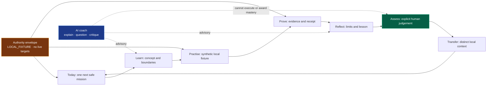

---

## 16. Pilot launch and worker transition

The learner pilot starts on the Windows operator workstation. Ubuntu becomes an
isolated worker only after local acceptance; a VPS is a later availability
choice, not a shortcut around host, key, egress, receipt, or posture gates.

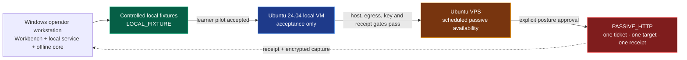
## 17. Case-pack learner loop and live-programme boundary

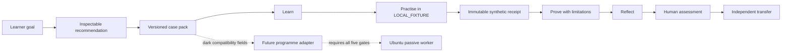

## 18. Five-gate transition to a passive pilot

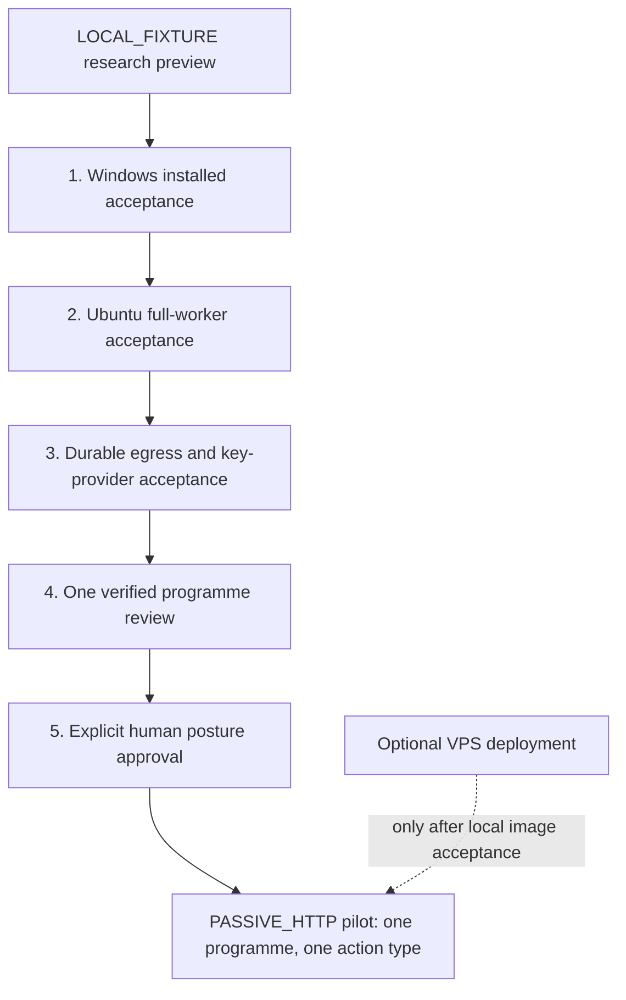

## 19. Interactive topic progression

```mermaid
flowchart LR
    Topic["Selected topic"] --> Note["Topic-owned focused note"]
    Note --> Lens["Traditional + AI lenses"]
    Lens --> L1["1 · Beginner orientation"]
    L1 --> L2["2 · Foundation mapping"]
    L2 --> L3["3 · Applied local controls"]
    L3 --> L4["4 · Independent transfer"]
    L3 --> Receipt["Synthetic evidence receipt"]
    Receipt --> Review["Human assessment"]
    Click["Trajectory click"] -. "previews path only" .-> L4
    Click -. "cannot award" .-> Review

    style Topic fill:#1e3a8a,stroke:#60a5fa,color:#fff
    style Receipt fill:#065f46,stroke:#10b981,color:#fff
    style Review fill:#78350f,stroke:#f59e0b,color:#fff
```

## 20. Public intelligence boundary

```mermaid
flowchart LR
    UI["Workbench Intelligence panel"] --> Plan["CONTRACT_ONLY request plan"]
    Plan --> Validate["CVE or versioned package validation"]
    Validate --> Registry["OSV · CISA KEV · EPSS · NVD · GitHub Advisories"]
    Registry -. "future accepted worker" .-> Fetch["Read-only fetch + bounded cache"]
    Fetch --> Source["Immutable source + retrieval evidence"]
    Source --> Offline["Offline enrichment and learning"]
    Offline -. "never becomes" .-> Proof["Live finding proof"]
    Target["Hostname · target · scan · exploit input"] --> Deny["Fail closed"]
    Account["HackerOne / Bugcrowd credentials"] -. "server-side gate only" .-> Fetch

    style Plan fill:#1e3a8a,stroke:#60a5fa,color:#fff
    style Source fill:#065f46,stroke:#10b981,color:#fff
    style Deny fill:#7f1d1d,stroke:#ef4444,color:#fff
    style Proof fill:#7f1d1d,stroke:#ef4444,color:#fff
```
