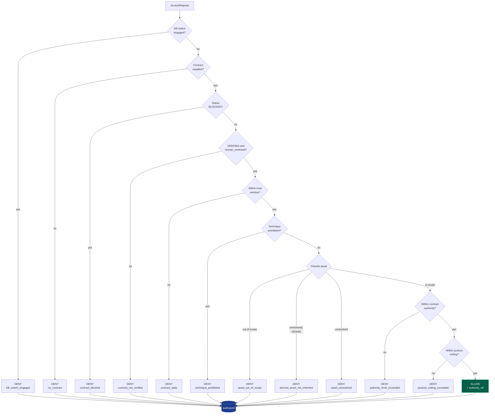
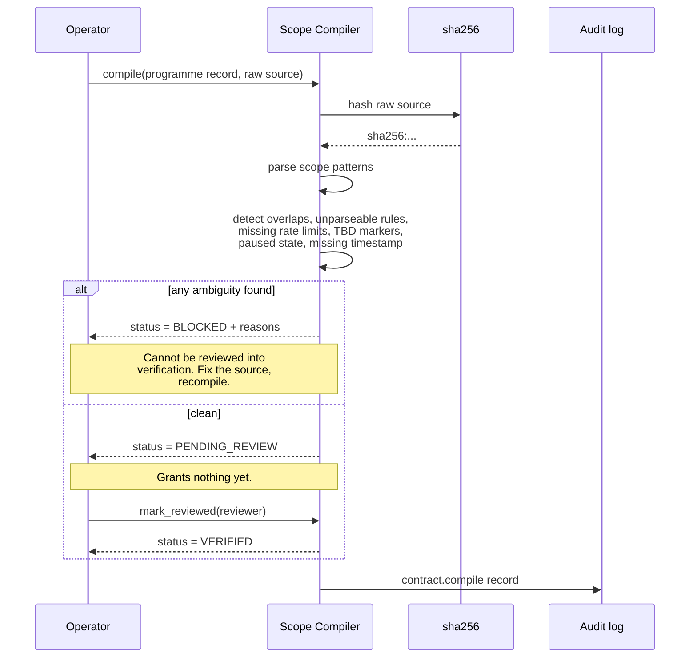
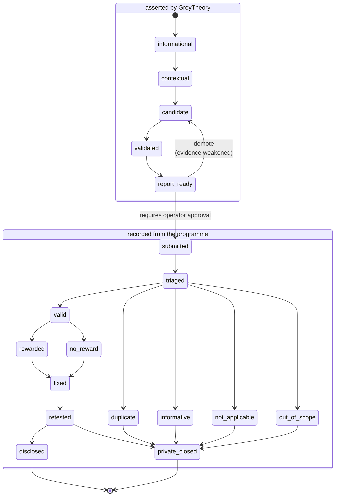
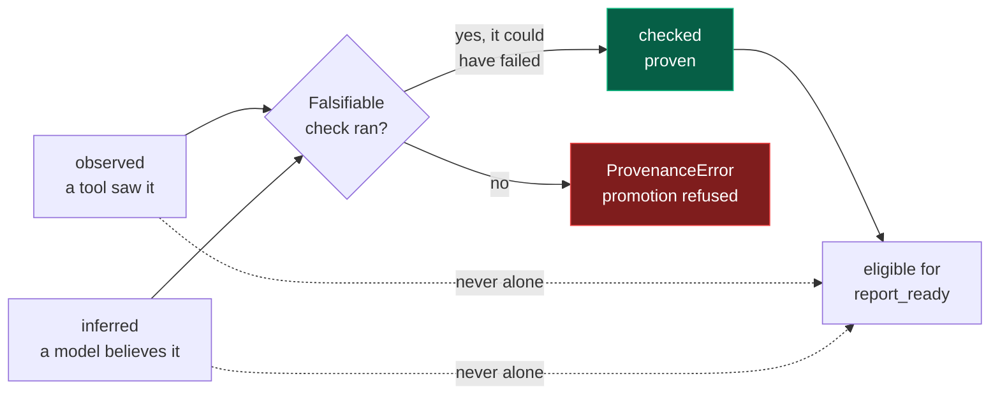
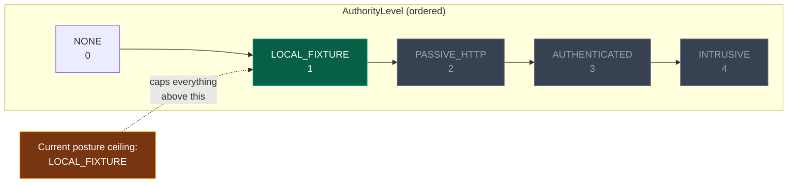

# Architecture Diagrams

Rendered by GitHub natively. Every diagram here reflects code that exists in `greytheory/` unless a node is explicitly marked *aspirational*.

---

## 1. The three planes

Authority is the root. Signal and Judgement both hang off it, and neither can reach a target except through the gate.

The crossed link from Grapevine to Plane 2 is the integration contract made visible: intelligence informs what we *look at* and what we *ask*, never what we *touch*.

---

## 2. Gate decision flow

Implemented in [`greytheory/authority/gate.py`](../greytheory/authority/gate.py). Every path — including every denial — writes an audit record before returning.

Eleven ways to be denied, one way to be allowed. That ratio is the design.

---

## 3. Contract compilation

The compiler cannot produce a contract that grants anything. Only a human can.

---

## 4. Finding lifecycle

Implemented in [`greytheory/findings.py`](../greytheory/findings.py). The dashed boundary is invariant I5 — everything past it is recorded from a programme, never asserted by us.

Two guards sit on that boundary:

- `report_ready` requires at least one `checked` claim. Inference alone is not a report.
- Every state past `submitted` requires `programme_evidence` — a reference to what the programme actually said.

---

## 5. The provenance triple

A check that cannot fail proves nothing, so promotion demands `could_have_failed=True`. This is what stops model output from laundering itself into evidence.

---

## 6. Authority levels

Two independent caps apply to every request: what the contract grants, and what the current operating posture allows. The lower of the two wins.

Greyed levels are unreachable under the current posture regardless of what any contract says.
