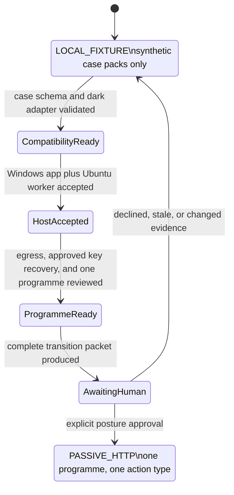

# Live-programme compatibility and transition gate

## Current truth

GreyTheory is a `LOCAL_FIXTURE` research preview. The case-pack contract can
describe the authority inputs a future programme adapter would need, but the
adapter is fixed to `state: dark` and `enabled: false`. It contains no target,
credential, provider, network client, or posture switch.

The local application may persist learner commands and run only the existing
synthetic, network-free fixture runner. An accepted learner command is still
reported as `executed: false`: it changes private learning state but grants no
research authority and proves no real vulnerability.

## Why compatibility exists now

A learner should not have to abandon the case method when moving from training
to authorised work. The stable case-pack shape preserves the parts that should
transfer:

1. authority and scope review;
2. a falsifiable theory;
3. the smallest safe experiment;
4. evidence roles and limitations;
5. reflection and human assessment; and
6. independent transfer in a distinct context.

Only the action adapter changes. The training adapter remains synthetic. A
future live-programme adapter must consume server-verified authority records;
it must never accept scope, credentials, or targets directly from the browser.

## Mandatory authority inputs

Every future live-programme binding must provide all of these server-owned
values:

- programme identifier;
- immutable source-bundle digest;
- reviewed scope-contract fingerprint;
- maximum permitted authority;
- programme rate limit;
- data-handling policy; and
- disclosure policy.

Missing, stale, conflicting, or user-interface-authored values fail closed.

## The five activation gates

The transition is not ready until every gate below has current acceptance
evidence:

1. **Installed Windows workbench acceptance** — a clean user can install,
   launch, reconnect, persist a complete learner journey, and recover safely.
   The bundled wheel, empty-prefix launcher/UI/snapshot check, and isolated
   current-user shortcut/restart/upgrade/runtime-recovery lifecycle pass. The
   evidence explicitly records `separate_user_accepted=false`; a genuinely
   separate account, release signing, and uninstall still do not pass, so this
   activation gate remains open.
2. **Full Ubuntu worker-host acceptance** — the owned-process service completes
   its no-route harness with unprivileged identity, encrypted evidence return,
   signed receipt, and deterministic cleanup. This gate passes for the owned
   Ubuntu 24.04.4 local fixture as of 2026-09-04; it grants no egress or posture.
3. **Egress and key-provider acceptance** — durable network constraints and an
   approved OS-bound key provider are proven independently of application UI.
   A namespace-lifetime Ubuntu nftables candidate now passes exact-address/port
   allowlisting, default-drop chains, counted bypass denials, and mutation
   refusal. Signed-input read-only image construction/runtime-admission code
   now exists but has no passed host record, so durable image binding remains
   unaccepted. A Windows
   CurrentUser DPAPI candidate passes same-profile restart,
   protected-copy recovery, tamper refusal, capture decryption, and audit
   checks. This gate remains open because application-data ACL hardening,
   independent cross-profile/bare-machine recovery, a profile/system backup
   procedure, hardened-image egress binding, and explicit operator approval
   have not passed.
4. **One verified programme review** — one current programme bundle has no
   unresolved scope, rate, data, or disclosure conflict and permits only the
   proposed passive action.
5. **Explicit human posture approval** — the operator deliberately raises the
   ceiling from `LOCAL_FIXTURE` to the narrowly defined posture after reviewing
   the complete evidence packet.

Passing four of five is still **not ready**. A VPS is not a shortcut around any
gate. Initial worker acceptance should occur in an isolated local Ubuntu VM;
a VPS becomes a deployment option only after the same image and control set
pass locally.

## Transition state machine

## What will signal the right time

GreyTheory should surface a transition-readiness panel only when all five gates
are machine-verifiably present. Until then, the product must show the live
programme bridge as **Not connected** and identify the next unmet gate. The
operator, not the software, makes the posture decision.
