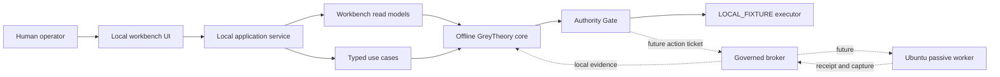
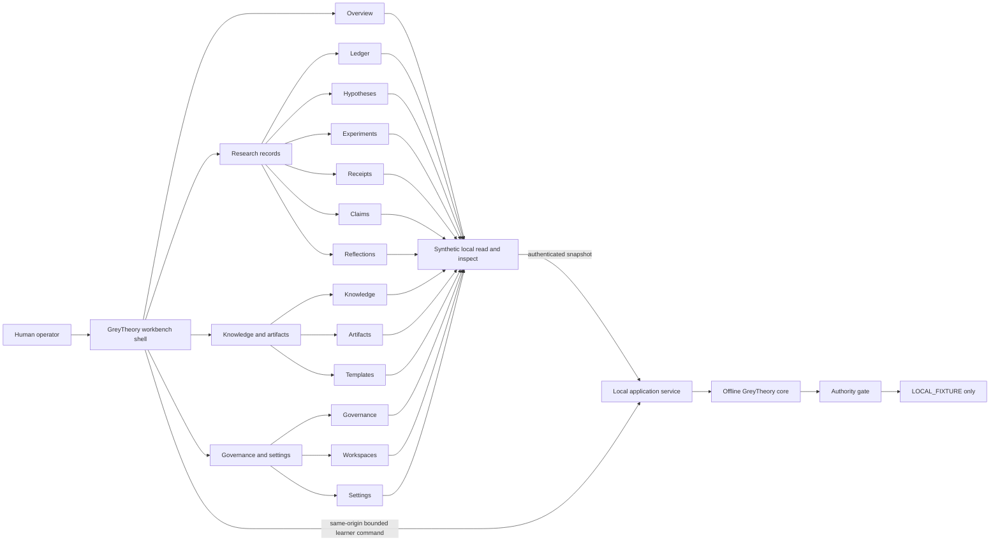

# GreyTheory Workbench Architecture

> **Status:** GUIDED MISSION CONTROL FOUNDATION PARTIAL; SAME-ORIGIN LEARNER COMMANDS IMPLEMENTED
>
> **Current posture:** `LOCAL_FIXTURE`; offline only; no target interaction
>
> **Visual implementation:** Guided Mission Control selected and implemented as the learner shell; local desktop/390/768/1024 responsive proof passes; installed acceptance remains open

This is the implementation contract common to every visual direction. It
defines what must work, which component owns each decision, and what evidence
will prove the local research pilot is usable. The earlier Research Ledger
prototype is implemented as an evidence-view baseline. The built learner UI can
now share the authenticated numeric-loopback application origin and persist a
bounded learning journey plus synthetic receipt. Separate development-preview
origins remain read-only. Visual acceptance of that persisted path and installed
packaging remain open.
The learner-first information architecture, agent-security track, bounded coach,
visualisations, and responsive acceptance contract live in
[`ai-native-learning-workbench.md`](ai-native-learning-workbench.md).

## 1. Product objective

GreyTheory should be the operator's day-to-day research environment: learn a
technique, form a falsifiable hypothesis, run a bounded local experiment,
capture evidence, decide what the evidence means, and retain the lesson. The
system succeeds when a session ends in checked evidence or reusable knowledge
without an authority violation.

The workbench must make the safe path the obvious path. It must not hide
uncertainty, imply that static analysis is live detection, or turn an ordinal
ranking into a vulnerability claim.

## 2. Deployment shape

### Current pilot

| Component | Initial home | Boundary |
|---|---|---|
| Operator workbench | Windows workstation | Local user only; selected desktop UI served or packaged locally |
| Application service | Same Windows workstation | Authenticated numeric `127.0.0.1` JSON only; no target-network route |
| GreyTheory core | Python process used by the application service | Dependency-free and offline |
| Private research data | Operator-chosen user-data root outside Git | Current-user permissions; raw evidence never enters the repository |
| Local fixtures | Controlled local process or in-memory runner | `LOCAL_FIXTURE`; explicit reset and provenance |

Windows is the recommended first launch environment because it is the actual
operator workstation and minimizes adoption friction. WSL may remain a
development convenience, but it is not the pilot's authority boundary.

### Passive worker later

The first `PASSIVE_HTTP` worker should run in a dedicated Ubuntu 24.04 VM or
small VPS only after the Milestone 9 preconditions pass. A local Ubuntu VM is
preferred for initial acceptance because it keeps cost and exposure low while
still proving the Linux service shape. A VPS becomes appropriate for scheduled
availability after the same worker image, broker controls, and evidence-return
path are proven locally.

The worker receives one short-lived action ticket for one action type and one
target. It cannot read the full research store, reinterpret scope, mint
approval, chain follow-up actions, or submit a report. It returns a receipt and
immutable capture; the core decides what those artifacts mean.

## 3. Component boundaries



### Workbench panel map

Every visible navigation entry now resolves to a working local prototype panel.
The panel shell supports search, status filtering, record inspection, responsive
context, and explicit action-boundary dialogs. Only the Research Ledger's
reflection is session-writable; application persistence remains the next
integration boundary.



The command edge applies only to the versioned learner journey and synthetic
fixture command contracts. It is not a general browser execution route, cannot
raise posture, and cannot reach a target.

### Workbench UI

Owns presentation, keyboard and pointer interaction, accessibility, navigation,
form state, and explanation. It displays authority and evidence state but does
not calculate or grant either.

### Local application service

Owns application sessions, typed commands, store assembly, serialisation,
concurrency, and error translation. It provides the single path from UI intent
to domain use case. It must bind only to loopback or equivalent local IPC in
the pilot and reject cross-origin or oversized requests.

The implemented `greytheory_local` adapter binds only to numeric
`127.0.0.1`, validates the exact Host header, requires an in-memory bearer
token for private reads, requires the exact same origin for writes, emits no
write-capable CORS permission, and caps strict JSON command bodies at 64 KiB.
An explicitly configured preview origin may read snapshots only. The launcher
may optionally serve one validated built UI directory with self-only browser
policy headers; it has no target-network client. ADR-0012 records the boundary.

### Offline core

Owns contracts, authority, approvals, audit, research records, ranking,
learning, validation, evidence, and reporting. It remains usable from the CLI
and tests without the workbench installed.

### Broker and worker

The network-free `greytheory_broker` and `greytheory_worker_contract` packages
now exist. The latter accepts only injected resolver/transport implementations
and proves exact-address, TLS-name, full-request-digest, no-proxy,
no-followed-redirect, zero-body, close, timeout, bounded-header, encryption,
kill-switch, and receipt behavior without importing network/process modules.
The separate `greytheory_worker` package now contains the resolver/direct-TLS
primitives and a dark two-phase owned-process service. The trusted parent keeps
ticket/receipt keys, replay and kill-switch state, capture private keys, and the
research store; the child receives one resolve command, then one exact-address
request only after the parent broker validates the complete DNS answer. It
scrubs its environment and must report non-root, zero-capability,
no-new-privileges Linux identity. Earlier offline Ubuntu 24.04 WSL2 acceptance
proves production numeric TLS and spawned-child cancellation only. The new full
service harness now has an owned Linux script, bounded Windows-side process
cleanup, isolated synthetic hosts view, clean fork-server worker start, and an
in-worker forked resolver. Recovered attempts still produced no complete JSON
record before shared WSL/Hermes startup became unreliable; successful full-path
host acceptance, durable OS egress controls, hardened image, and authorised
programme evidence remain mandatory before any posture change.

## 4. Stable application contract

Every workbench snapshot must include:

- schema version and generation time;
- operating posture and explicit live-target availability;
- active workspace/session identifiers, or `UNKNOWN` when none is configured;
- one primary next action with its reason;
- capability truth from `greytheory.capabilities`;
- authority, scope, evidence, and audit readiness as separate states;
- data-source freshness and error state; and
- links by stable record id, never by screen position.

Every consequential command must include:

- command id and expected schema version;
- operator identity reference;
- workspace, programme, contract fingerprint, and target asset where relevant;
- the requested authority and effect budget;
- an idempotency key;
- the expected current record version; and
- an explicit acknowledgement when human judgement is required.

The service returns a typed result: accepted for domain processing, refused with
a stable reason, conflict because state changed, or invalid input. `accepted`
does not mean `executed`; execution still requires a fresh gate decision.

## 5. Primary journeys

The navigation labels and visual hierarchy will change with the modernized concept,
but these journeys are required.

### Today / Home

- Restore the active local workspace and current session.
- Show the exact posture and whether live-target capability exists.
- Present one next action, not an undifferentiated list of alerts.
- Explain `UNKNOWN` data and offer the setup action that resolves it.

### Learn

- Select a card from prerequisites, review timing, and the operator's goal.
- Move through **Learn -> Practise -> Prove -> Reflect**.
- Launch only the card's synthetic local fixture.
- Record evidence-bound human assessments across all six mastery dimensions.
- Never award mastery from fixture completion or model output alone.

### Programmes

- Register captured source bundles, inspect precedence and conflicts, and record
  human review.
- Surface stale, changed, removed, unreachable, and unresolved states without
  converting any of them into permission.
- Keep the YNAB conflicts explicitly unresolved until the operator decides.

### Research

- Create or resume a structured session.
- Select and inspect an `unproven` hypothesis from the transparent queue.
- Show assumptions, factor provenance, uncertainty, scope readiness, experiment
  budget, and learning value.
- Submit a typed local action intent and show the resulting decision and receipt.

### Evidence

- Trace observation -> artifact -> deterministic check -> claim role -> finding.
- Verify hashes and show redaction/export readiness separately.
- Refuse partial export or evidence with failed integrity.

### Reports

- Build drafts from the claim-evidence matrix.
- Keep impact and reproduction uncertainty visible.
- Require submission-time scope recheck and a human Gate G decision.
- Provide export only; no submission, contact, or disclosure action.

### Settings / Readiness

- Configure private roots and integration adapters without storing secrets in
  the repository.
- Show implemented, partial, planned, and unavailable capabilities from the
  executable register.
- Run local health, fixture, audit-chain, and storage checks.
- Do not expose a control that raises posture as an ordinary preference.

### Learner-first shell

The primary navigation groups thirteen working journeys as Today, Learn,
Practise, Research, Prove, Library, and System. Mission Control, Learn, Safe Lab,
Programmes, Cases, Hypotheses, Intelligence, Evidence, Reports, Readiness, Demo
Suite, Library, and Settings remain individually reachable. The Research Ledger
remains the chronological case view; it is no longer the default home screen.

The home surface presents one next safe mission and explains its prerequisites,
reason, expected time, fixture, required evidence, and assessment. Agentic-
system security is a specialization built on web/API authorization and evidence
practice. See [`ai-native-learning-workbench.md`](ai-native-learning-workbench.md)
for the exact recommendation, visualisation, coach, and responsive contracts.

## 6. Learning architecture

The guided-learning layer is an orchestration over existing records, not a
second mastery system.

```text
operator goal + prerequisite graph + review due dates
  -> suggested card and dimension
  -> short explanation and falsifiable check
  -> synthetic fixture practice
  -> artifact or reflection
  -> explicit human assessment
  -> mastery record and next review
  -> reusable lesson linked to research
```

Scheduling is deterministic and inspectable. `adaptive-evidence-review-v1`
uses only earlier credited human assessments for the same card and dimension:
the first assessment uses the level's base interval, one retained or improved
assessment extends it by 50 percent, two or more consecutive retained or
improved assessments double it (capped at 180 days), and regression halves the
base interval (with a three-day floor). Test-fixture assessments never affect
the schedule. Every persisted assessment carries the policy reference and a
plain-language rationale; an explicit operator date remains possible and is
labelled as such.

Three tracks share the same five-stage journey. `standard` supplies no hidden
assistance. `assisted` exposes a security-property and evidence checklist but
cannot evidence mastery above `assisted`. `transfer` is operator-selected,
targets the transfer dimension, requires independent test and prove evidence,
and requires a distinct local context reference in both proof and final human
assessment. A model may explain, question, or critique, but it cannot select
hidden criteria, award mastery, or promote a claim.

## 7. UX truth rules

- `UNKNOWN` never renders as zero, healthy, or complete.
- `LIVE` means code exists; readiness is a separate runtime measurement.
- `LOCAL_FIXTURE` is visible on every research and execution surface.
- Ranking scores are labelled ordinal and `unproven`.
- Amber is authority, emerald is verified proof, and red is refusal. They are
  semantic colours, not decoration.
- Refusal includes the reason and the safe recovery action.
- The workbench does not use cyberpunk imagery, fake scanning, or autonomous
  language.
- Desktop is primary for the pilot; the core journeys remain operable at a
  390-pixel viewport before the UI is considered responsive.

## 8. Foundation acceptance evidence

| Requirement | Evidence required |
|---|---|
| Capability truth does not drift | Typed register tests plus dashboard/workbench contract tests |
| Core stays offline | Existing import policy and full repository suite |
| Workbench cannot execute directly | Application contract tests and architectural dependency check |
| Local pages cannot ambiently reach private state | Numeric Host/token/origin, duplicate-header, CORS, and size-limit transport tests |
| Missing data remains honest | Empty-store and failed-store render tests |
| Primary journeys work | Browser tests using realistic local fixture data at desktop and 390 px |
| Accessibility is usable | Keyboard path, focus order, labels, contrast, reduced motion checks |
| Private state stays outside Git | Storage guard tests and clean-worktree acceptance |
| Passive capability stays dark | No network worker package, posture remains `LOCAL_FIXTURE`, denial tests pass |

## 9. Current implementation boundary

Implemented now:

- the existing static dashboard read model and renderers;
- the executable capability register shared by future surfaces; and
- this application, process, storage, learning, and worker contract;
- the transport-neutral `greytheory_app` application service with versioned
  snapshots across programmes, learning, research, hypotheses, evidence,
  reports, approvals, audit readiness, and capability truth;
- idempotent, optimistic-revision learning command handlers;
- create-only unproven-hypothesis, explicit human scope-review, and atomic
  experiment-planning handlers; authority is derived from persisted workspace
  and hypothesis state, and all results remain non-executing;
- a fresh, explicit, evidence-bound human mastery-assessment handler; assessor
  identity is derived from the configured local operator, not supplied by the
  UI, and fixtures, models, and journeys still award nothing automatically;
- an explicit private report-export handler and atomic writer; it consumes only
  server-held report-ready findings/drafts and verified redacted evidence,
  writes no UI-supplied path, and records that no submission occurred;
- a bounded `LOCAL_FIXTURE` action-intent handler; it admits only an active
  server-held experiment action and in-scope hypothesis target, derives
  authority/identity/stop conditions, and creates no Gate decision or receipt;
- an integrity-checked private report-case store, full claim-role/check-receipt
  round trip, informational case-creation handler, revision-safe draft editing,
  and measured draft completeness in the read model; authority, programme,
  asset, finding state, and claim matrix remain server-owned;
- fresh human-bound Gates B-F validation with server-derived attester identity,
  known evidence references, immutable revision-bound run history, automatic
  current-status invalidation after later case edits, optimistic revisions, and
  explicit separation from claim/finding promotion, export, or submission;
- exact two-account-fixture claim assembly from raw evidence already held in
  the private vault: five deterministic receipt-backed roles plus two
  operator-attested judgement roles, persisted atomically with the report
  matrix and no new target action;
- next-state-only internal lifecycle progression with a current Gates B-F pass
  required for `report_ready`, a hard stop before submission/programme
  outcomes, and private export of the digest-bound finding/receipt chain;
- the separate `greytheory_local` private-runtime assembly, strict versioned
  JSON decoder, authenticated numeric-loopback snapshot/command transport, and
  `greytheory-workbench` Windows-first launch command;
- optional bounded same-origin UI serving with a self-only content policy,
  cross-origin isolation headers, no caching, safe suffix and size limits, and
  no directory traversal;
- reproducible Windows wheel assembly that stages the built UI and complete
  learning resources, plus an empty-prefix acceptance harness that verifies the
  installed console launcher, loopback UI, health posture, authenticated
  snapshot, exact-process cleanup, and a non-echoed ephemeral environment
  token;
- a current-user installer that keeps the replaceable application runtime
  separate from private research data, creates a Start Menu shortcut, and has
  passed real same-origin journey persistence, restart, same-wheel upgrade,
  and runtime-recovery acceptance without enabling target networking;
- three versioned Case Packs, an immutable private synthetic-receipt store, one
  practise-stage fixture command, and the graphical Learn -> Practise -> Prove
  -> Reflect binding; the live-programme adapter remains dark and disabled;
- the separate, network-free `greytheory_broker` `passive-head-v1` contracts,
  policy guard, replay ledger, default-engaged kill switch, and signed receipt
  metadata foundation, plus ticket-bound authenticated capture encryption and
  an authorised external-KEK-wrapped recipient-key lifecycle;
- the network-free `greytheory_worker_contract` orchestration boundary and its
  injected resolver/direct-transport conformance suite;
- `greytheory_worker` owned-child resolver, numeric direct-TLS primitive, and
  capped two-command spawned-process assembly, unit-verified with strict child
  identity/environment/lifecycle rules plus the earlier bounded Ubuntu
  primitive host proof;
- an operator-side Windows CurrentUser DPAPI root-KEK candidate with strict
  records, audited provision/lease operations, a zeroing lease, and real
  same-profile restart/protected-copy recovery, tamper-refusal, capture, and
  audit proof; it is not approved and never gives key authority to the worker;
- a signed-input, two-build read-only Ubuntu image and strict clean-HEAD WSL2
  runtime-admission candidate that passes mount, identity, exact-egress,
  encrypted-capture, receipt, and replay checks while explicitly retaining
  `hardened_worker_image_accepted=false` and reboot/VM conformance as open;
- deterministic learning recommendations, prerequisite routing, review
  intervals, Learn/Practise/Prove/Reflect/Assess journey state, private
  integrity-checked journey persistence, optimistic revisions, and CLI flow.

Not implemented now:

- whole-application first-entry keyboard traversal of the same-origin persisted
  learner path, a genuinely separate-account install run, release signing, and
  uninstall acceptance; current-user shortcut/upgrade/recovery already pass;
- general/passive claim-role assembly and later research operations beyond the
  exact local fixture; external submission/programme outcomes stay unavailable;
- broader ready curricula beyond the first local Case Pack and governed
  model-backed coach conversation;
- a general local fixture process broker;
- operator approval, hardened application-data ACLs, and independent recovery
  for the candidate root-KEK provider; host acceptance and VM/reboot conformance
  for the reproducible image candidate that makes the accepted
  namespace-lifetime nftables policy mandatory,
  launcher/scheduler, or any `PASSIVE_HTTP` action; the full Ubuntu no-route
  service and exact-egress local-fixture candidates now pass.

The current Research Ledger remains a first-class Research case view. Guided
Mission Control is the selected shell. Current browser visual, same-origin
persistence, route-focus, mobile-drawer/modal focus, isolated wheel-install,
and current-user lifecycle checks pass. Whole-application first-entry keyboard
traversal plus a genuinely separate-account and signed-release run remain
before the Windows pilot exit condition is met.
