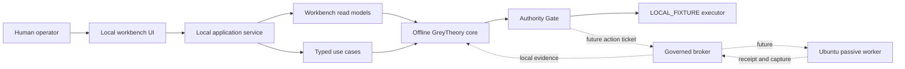

# GreyTheory Workbench Architecture

> **Status:** FOUNDATION IN PROGRESS
>
> **Current posture:** `LOCAL_FIXTURE`; offline only; no target interaction
>
> **Visual implementation:** awaiting operator selection from three audited concepts

This is the implementation contract common to every visual direction. It
defines what must work, which component owns each decision, and what evidence
will prove the local research pilot is usable. It does not claim that the
graphical workbench has been built.

## 1. Product objective

GreyTheory should be the operator's day-to-day research environment: learn a
technique, form a falsifiable hypothesis, run a bounded local experiment,
capture evidence, decide what the evidence means, and retain the lesson. The
system succeeds when a session ends in checked evidence or reusable knowledge
without an authority violation.

The workbench must make the safe path the obvious path. It must not hide
uncertainty, imply that static analysis is live detection, or turn an ordinal
ranking into a vulnerability claim.

## 2. Deployment shape

### Current pilot

| Component | Initial home | Boundary |
|---|---|---|
| Operator workbench | Windows workstation | Local user only; selected desktop UI served or packaged locally |
| Application service | Same Windows workstation | Authenticated numeric `127.0.0.1` JSON only; no target-network route |
| GreyTheory core | Python process used by the application service | Dependency-free and offline |
| Private research data | Operator-chosen user-data root outside Git | Current-user permissions; raw evidence never enters the repository |
| Local fixtures | Controlled local process or in-memory runner | `LOCAL_FIXTURE`; explicit reset and provenance |

Windows is the recommended first launch environment because it is the actual
operator workstation and minimizes adoption friction. WSL may remain a
development convenience, but it is not the pilot's authority boundary.

### Passive worker later

The first `PASSIVE_HTTP` worker should run in a dedicated Ubuntu 24.04 VM or
small VPS only after the Milestone 9 preconditions pass. A local Ubuntu VM is
preferred for initial acceptance because it keeps cost and exposure low while
still proving the Linux service shape. A VPS becomes appropriate for scheduled
availability after the same worker image, broker controls, and evidence-return
path are proven locally.

The worker receives one short-lived action ticket for one action type and one
target. It cannot read the full research store, reinterpret scope, mint
approval, chain follow-up actions, or submit a report. It returns a receipt and
immutable capture; the core decides what those artifacts mean.

## 3. Component boundaries



### Workbench UI

Owns presentation, keyboard and pointer interaction, accessibility, navigation,
form state, and explanation. It displays authority and evidence state but does
not calculate or grant either.

### Local application service

Owns application sessions, typed commands, store assembly, serialisation,
concurrency, and error translation. It provides the single path from UI intent
to domain use case. It must bind only to loopback or equivalent local IPC in
the pilot and reject cross-origin or oversized requests.

The implemented `greytheory_local` adapter binds only to numeric
`127.0.0.1`, validates the exact Host header, requires an in-memory bearer
token for private reads, requires the exact same origin for writes, emits no
CORS permission, and caps strict JSON command bodies at 64 KiB. It serves no
files and has no target-network client. ADR-0012 records the boundary.

### Offline core

Owns contracts, authority, approvals, audit, research records, ranking,
learning, validation, evidence, and reporting. It remains usable from the CLI
and tests without the workbench installed.

### Broker and worker

The network-free `greytheory_broker` and `greytheory_worker_contract` packages
now exist. The latter accepts only injected resolver/transport implementations
and proves exact-address, TLS-name, full-request-digest, no-proxy,
no-followed-redirect, zero-body, close, timeout, bounded-header, encryption,
kill-switch, and receipt behavior without importing network/process modules.
The actual resolver, direct TLS/HTTP transport, isolated worker process/image,
and broker transport do not exist and remain mandatory before any posture
change.

## 4. Stable application contract

Every workbench snapshot must include:

- schema version and generation time;
- operating posture and explicit live-target availability;
- active workspace/session identifiers, or `UNKNOWN` when none is configured;
- one primary next action with its reason;
- capability truth from `greytheory.capabilities`;
- authority, scope, evidence, and audit readiness as separate states;
- data-source freshness and error state; and
- links by stable record id, never by screen position.

Every consequential command must include:

- command id and expected schema version;
- operator identity reference;
- workspace, programme, contract fingerprint, and target asset where relevant;
- the requested authority and effect budget;
- an idempotency key;
- the expected current record version; and
- an explicit acknowledgement when human judgement is required.

The service returns a typed result: accepted for domain processing, refused with
a stable reason, conflict because state changed, or invalid input. `accepted`
does not mean `executed`; execution still requires a fresh gate decision.

## 5. Primary journeys

The navigation labels and visual hierarchy may change with the chosen concept,
but these journeys are required.

### Today / Home

- Restore the active local workspace and current session.
- Show the exact posture and whether live-target capability exists.
- Present one next action, not an undifferentiated list of alerts.
- Explain `UNKNOWN` data and offer the setup action that resolves it.

### Learn

- Select a card from prerequisites, review timing, and the operator's goal.
- Move through **Learn -> Practise -> Prove -> Reflect**.
- Launch only the card's synthetic local fixture.
- Record evidence-bound human assessments across all six mastery dimensions.
- Never award mastery from fixture completion or model output alone.

### Programmes

- Register captured source bundles, inspect precedence and conflicts, and record
  human review.
- Surface stale, changed, removed, unreachable, and unresolved states without
  converting any of them into permission.
- Keep the YNAB conflicts explicitly unresolved until the operator decides.

### Research

- Create or resume a structured session.
- Select and inspect an `unproven` hypothesis from the transparent queue.
- Show assumptions, factor provenance, uncertainty, scope readiness, experiment
  budget, and learning value.
- Submit a typed local action intent and show the resulting decision and receipt.

### Evidence

- Trace observation -> artifact -> deterministic check -> claim role -> finding.
- Verify hashes and show redaction/export readiness separately.
- Refuse partial export or evidence with failed integrity.

### Reports

- Build drafts from the claim-evidence matrix.
- Keep impact and reproduction uncertainty visible.
- Require submission-time scope recheck and a human Gate G decision.
- Provide export only; no submission, contact, or disclosure action.

### Settings / Readiness

- Configure private roots and integration adapters without storing secrets in
  the repository.
- Show implemented, partial, planned, and unavailable capabilities from the
  executable register.
- Run local health, fixture, audit-chain, and storage checks.
- Do not expose a control that raises posture as an ordinary preference.

## 6. Learning architecture

The guided-learning layer is an orchestration over existing records, not a
second mastery system.

```text
operator goal + prerequisite graph + review due dates
  -> suggested card and dimension
  -> short explanation and falsifiable check
  -> synthetic fixture practice
  -> artifact or reflection
  -> explicit human assessment
  -> mastery record and next review
  -> reusable lesson linked to research
```

Initial scheduling must be deterministic and inspectable. A model may explain,
question, or critique, but it cannot select hidden criteria, award mastery, or
promote a claim. Adaptive scheduling is not complete until its policy,
explanations, clock behaviour, and regression fixtures are tested.

## 7. UX truth rules

- `UNKNOWN` never renders as zero, healthy, or complete.
- `LIVE` means code exists; readiness is a separate runtime measurement.
- `LOCAL_FIXTURE` is visible on every research and execution surface.
- Ranking scores are labelled ordinal and `unproven`.
- Amber is authority, emerald is verified proof, and red is refusal. They are
  semantic colours, not decoration.
- Refusal includes the reason and the safe recovery action.
- The workbench does not use cyberpunk imagery, fake scanning, or autonomous
  language.
- Desktop is primary for the pilot; the core journeys remain operable at a
  390-pixel viewport before the UI is considered responsive.

## 8. Foundation acceptance evidence

| Requirement | Evidence required |
|---|---|
| Capability truth does not drift | Typed register tests plus dashboard/workbench contract tests |
| Core stays offline | Existing import policy and full repository suite |
| Workbench cannot execute directly | Application contract tests and architectural dependency check |
| Local pages cannot ambiently reach private state | Numeric Host/token/origin, duplicate-header, CORS, and size-limit transport tests |
| Missing data remains honest | Empty-store and failed-store render tests |
| Primary journeys work | Browser tests using realistic local fixture data at desktop and 390 px |
| Accessibility is usable | Keyboard path, focus order, labels, contrast, reduced motion checks |
| Private state stays outside Git | Storage guard tests and clean-worktree acceptance |
| Passive capability stays dark | No network worker package, posture remains `LOCAL_FIXTURE`, denial tests pass |

## 9. Current implementation boundary

Implemented now:

- the existing static dashboard read model and renderers;
- the executable capability register shared by future surfaces; and
- this application, process, storage, learning, and worker contract;
- the transport-neutral `greytheory_app` application service with versioned
  snapshots across programmes, learning, research, hypotheses, evidence,
  reports, approvals, audit readiness, and capability truth;
- idempotent, optimistic-revision learning command handlers;
- create-only unproven-hypothesis, explicit human scope-review, and atomic
  experiment-planning handlers; authority is derived from persisted workspace
  and hypothesis state, and all results remain non-executing;
- a fresh, explicit, evidence-bound human mastery-assessment handler; assessor
  identity is derived from the configured local operator, not supplied by the
  UI, and fixtures, models, and journeys still award nothing automatically;
- an explicit private report-export handler and atomic writer; it consumes only
  server-held report-ready findings/drafts and verified redacted evidence,
  writes no UI-supplied path, and records that no submission occurred;
- a bounded `LOCAL_FIXTURE` action-intent handler; it admits only an active
  server-held experiment action and in-scope hypothesis target, derives
  authority/identity/stop conditions, and creates no Gate decision or receipt;
- an integrity-checked private report-case store, full claim-role/check-receipt
  round trip, informational case-creation handler, revision-safe draft editing,
  and measured draft completeness in the read model; authority, programme,
  asset, finding state, and claim matrix remain server-owned;
- fresh human-bound Gates B-F validation with server-derived attester identity,
  known evidence references, immutable revision-bound run history, automatic
  current-status invalidation after later case edits, optimistic revisions, and
  explicit separation from claim/finding promotion, export, or submission;
- exact two-account-fixture claim assembly from raw evidence already held in
  the private vault: five deterministic receipt-backed roles plus two
  operator-attested judgement roles, persisted atomically with the report
  matrix and no new target action;
- next-state-only internal lifecycle progression with a current Gates B-F pass
  required for `report_ready`, a hard stop before submission/programme
  outcomes, and private export of the digest-bound finding/receipt chain;
- the separate `greytheory_local` private-runtime assembly, strict versioned
  JSON decoder, authenticated numeric-loopback snapshot/command transport, and
  `greytheory-workbench` Windows-first launch command;
- the separate, network-free `greytheory_broker` `passive-head-v1` contracts,
  policy guard, replay ledger, default-engaged kill switch, and signed receipt
  metadata foundation, plus ticket-bound authenticated capture encryption and
  an authorised external-KEK-wrapped recipient-key lifecycle;
- the network-free `greytheory_worker_contract` orchestration boundary and its
  injected resolver/direct-transport conformance suite;
- deterministic learning recommendations, prerequisite routing, review
  intervals, Learn/Practise/Prove/Reflect/Assess journey state, private
  integrity-checked journey persistence, optimistic revisions, and CLI flow.

Not implemented now:

- the selected interactive UI;
- the graphical application shell, installed shortcut, and packaged Windows
  host acceptance;
- general/passive claim-role assembly and later research operations beyond the
  exact local fixture; external submission/programme outcomes stay unavailable;
- adaptive scheduling, assisted/transfer-specific journeys, and the graphical
  Learn surface;
- a general local fixture process broker;
- any actual DNS/TLS/HTTP implementation, approved OS secret-provider binding
  for the root KEK, Ubuntu worker, or `PASSIVE_HTTP` action.

The next implementation step is to select one of the three audited visual
directions, then bind that shell to the implemented local endpoint and complete
the Today/Learn/Research browser journey without changing posture.
